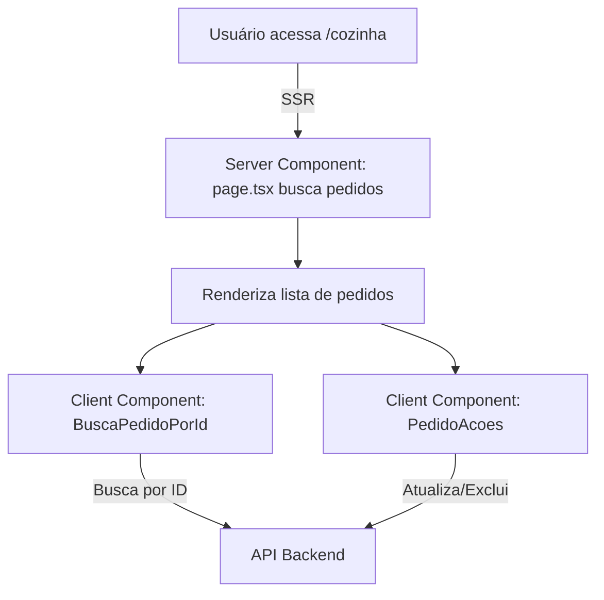

# Guia de Arquitetura: Next.js, React e Estrutura do Projeto

## 1. Conceitos Fundamentais

### React

- **React** é uma biblioteca JavaScript para criar interfaces de usuário de forma declarativa e reativa.
- Utiliza **componentes** (funções ou classes) para dividir a interface em partes reutilizáveis.
- Usa hooks como `useState` e `useEffect` para controlar estado e efeitos colaterais.

### Next.js

- **Next.js** é um framework para React que facilita a criação de aplicações web modernas, rápidas e otimizadas para SEO.
- Permite renderização no servidor (**SSR**) e no cliente (**CSR**), além de rotas automáticas e organização de arquivos.
- Utiliza a pasta `app/` (novo padrão) para definir rotas e componentes.

### Server Component vs Client Component

- **Server Component**: Executado no servidor, ideal para buscar dados e montar páginas já prontas. Não pode usar hooks de React.
- **Client Component**: Executado no navegador, ideal para interatividade. Usa `'use client'` no topo do arquivo e pode usar hooks.

### 'use client'

- Diretiva que indica ao Next.js que o componente deve ser executado no cliente (navegador).
- Sem ela, o arquivo é tratado como Server Component.

---

## 2. Estrutura e Decisões do Projeto

### Objetivo

- Criar um sistema de restaurante com:
  - Formulário para o garçom enviar pedidos.
  - Página da cozinha para visualizar, buscar, atualizar e excluir pedidos.
  - Dados sempre atualizados ao navegar (sem reload manual).

### Estrutura de Pastas e Arquivos

```
frontend-restaurante/
  app/
    page.tsx                # Página inicial (formulário de pedidos)
    cozinha/
      page.tsx              # Página da cozinha (Server Component)
      BuscaPedidoPorId.tsx  # Busca interativa por ID (Client Component)
      PedidoAcoes.tsx       # Botões de ação (Client Component)
```

### O que foi implementado e por quê

#### 1. `app/cozinha/page.tsx` (Server Component)

- **Responsabilidade:** Buscar pedidos do backend e montar a página da cozinha.
- **Por quê Server Component?**
  - Garante que os dados estejam sempre atualizados ao navegar para a página.
  - Melhora performance e SEO, pois a página já vem "pronta" do servidor.
  - Não precisa de interatividade direta (apenas exibe dados e inclui Client Components para ações).

#### 2. `app/cozinha/BuscaPedidoPorId.tsx` (Client Component)

- **Responsabilidade:** Permitir busca de pedidos por ID de forma interativa, sem recarregar a página.
- **Por quê Client Component?**
  - Precisa de hooks (`useState`, `useEffect`) para controlar o formulário e buscar dados ao clicar no botão.
  - Executa no navegador, proporcionando experiência dinâmica ao usuário.

#### 3. `app/cozinha/PedidoAcoes.tsx` (Client Component)

- **Responsabilidade:** Permitir atualizar o status ou excluir pedidos com botões.
- **Por quê Client Component?**
  - Precisa de interatividade (cliques, requisições para atualizar/excluir).
  - Usa hooks para feedback visual e atualização local.

#### 4. `app/page.tsx` (Server Component)

- **Responsabilidade:** Página inicial, exibe o formulário de pedidos e o cardápio.
- **Por quê Server Component?**
  - Busca dados do cardápio no backend.
  - Inclui o formulário (Client Component) para envio de pedidos.

---

## 3. Benefícios desta Arquitetura

- **Dados sempre atualizados:** SSR garante que a cozinha veja os pedidos mais recentes sem precisar recarregar.
- **Interatividade moderna:** Client Components permitem buscas, atualizações e exclusões sem reload.
- **Organização e manutenção:** Cada arquivo tem uma responsabilidade clara, facilitando manutenção e evolução.
- **Performance e SEO:** SSR entrega páginas prontas e rápidas para o usuário e para motores de busca.

---

## 4. Resumo Visual



---

## 5. Dicas para Evoluir

- Sempre separe lógica de dados (Server Component) da interatividade (Client Component).
- Use `'use client'` apenas onde realmente precisa de hooks ou manipulação do DOM.
- Aproveite o SSR para páginas que precisam de dados sempre frescos.
- Mantenha os componentes pequenos e focados em uma responsabilidade.

---

## 6. Atualização: Feedback Visual Imediato ao Atualizar Status

### Nova Arquitetura para Experiência Moderna

Para garantir que, ao atualizar o status de um pedido, o card seja movido visualmente entre as listas ("em preparação" e "pronto") sem recarregar a página, foi implementado um padrão profissional usando um Client Component para gerenciar o estado local das listas.

### Como funciona:

- O Server Component (`page.tsx`) busca os pedidos do backend e passa os dados para o Client Component `CozinhaPedidosList`.
- O Client Component `CozinhaPedidosList` mantém o estado local das listas de pedidos.
- Quando o status de um pedido é atualizado (via `PedidoAcoes`), o card é movido imediatamente para a lista correta, sem reload.
- O mesmo ocorre ao excluir um pedido: o card some da lista instantaneamente.

### Estrutura dos arquivos:

```
app/
  cozinha/
    page.tsx               # Server Component: busca dados e entrega para o Client Component
    CozinhaPedidosList.tsx # Client Component: gerencia e renderiza as listas com estado local
    PedidoAcoes.tsx        # Client Component: botões de ação (atualizar/excluir)
    BuscaPedidoPorId.tsx   # Client Component: busca interativa por ID
```

### Por que essa abordagem?

- **Feedback visual imediato:** O usuário vê o card mudando de lista na hora, sem reload.
- **Separação de responsabilidades:**
  - Server Component só busca dados e entrega para o Client.
  - Client Component cuida da experiência dinâmica e do estado local.
- **Padrão profissional:** Mantém o SSR para dados iniciais e usa Client Components apenas onde há interatividade.

### Fluxo resumido:

1. Usuário clica para mudar o status de um pedido.
2. `PedidoAcoes` faz a requisição para o backend e, ao sucesso, chama o callback do pai.
3. `CozinhaPedidosList` atualiza o estado local, movendo o card para a lista correta.
4. O usuário vê o card sumir de uma lista e aparecer na outra imediatamente.

---

## 7. Garantindo dados sempre atualizados ao navegar para a cozinha

### Problema resolvido

Ao criar novos pedidos na página inicial e navegar para /cozinha, os novos pedidos não apareciam automaticamente sem dar reload manual. Isso acontecia porque o Next.js pode reutilizar o Client Component com dados "antigos" do SSR, sem refazer a busca.

### Solução profissional implementada

- O Client Component `CozinhaPedidosList` agora faz uma nova busca dos pedidos diretamente no backend sempre que a página é exibida (montada) ou quando a aba volta a ficar visível (foco).
- Isso garante que, ao navegar para /cozinha, a lista de pedidos estará sempre atualizada, sem precisar de reload manual.
- O feedback visual local (mover o card entre listas ao atualizar status/excluir) continua funcionando normalmente, pois o estado local é mantido e atualizado instantaneamente.

### Como funciona na prática

- Ao acessar ou voltar para a página /cozinha, o componente faz um fetch dos pedidos mais recentes.
- Se você atualizar o status de um pedido, o card é movido de lista imediatamente (feedback local).
- Se um novo pedido for criado em outra página, ao navegar para /cozinha ele aparecerá automaticamente.

### Exemplo de código relevante

```tsx
// CozinhaPedidosList.tsx (trecho)
useEffect(() => {
  fetchPedidos();
  const handleVisibility = () => {
    if (document.visibilityState === 'visible') {
      fetchPedidos();
    }
  };
  document.addEventListener('visibilitychange', handleVisibility);
  return () =>
    document.removeEventListener('visibilitychange', handleVisibility);
}, [fetchPedidos]);
```

### Benefícios

- Experiência moderna: dados sempre frescos ao navegar, sem reload manual.
- Feedback visual local preservado ao atualizar status/excluir.
- Código limpo, sem redundância, e fácil de manter.

---

## 8. Exemplo de código relevante

```tsx
// page.tsx (Server Component)
export default async function CozinhaPage() {
  // ...busca pedidos...
  return (
    <main>
      <BuscaPedidoPorId />
      <CozinhaPedidosList
        pedidosPreparando={pedidosPreparando}
        pedidosProntos={pedidosProntos}
      />
    </main>
  );
}

// CozinhaPedidosList.tsx (Client Component)
('use client');
export default function CozinhaPedidosList({
  pedidosPreparando,
  pedidosProntos,
}) {
  const [prep, setPrep] = useState(pedidosPreparando);
  const [prontos, setProntos] = useState(pedidosProntos);
  // ...handlers para atualizar status e excluir...
}
```

---

## 9. Garantindo atualização SSR e client-side ao navegar entre páginas

### Problema

No Next.js App Router, navegar entre páginas usando Link ou router.push não recarrega o componente nem refaz o SSR, o que pode deixar dados desatualizados e o formulário sem funcionar corretamente após navegação.

### Solução profissional implementada

- **Atualização automática ao navegar:**
  - O Client Component `CozinhaPedidosList` agora usa o hook `usePathname` do Next.js para detectar mudanças de rota e faz um novo fetch dos pedidos sempre que a rota muda (ex: ao navegar para /cozinha).
- **Forçar atualização SSR após novo pedido:**
  - O formulário (`FormularioPedido`) chama `router.refresh()` após enviar um pedido com sucesso, garantindo que ao navegar para /cozinha os dados SSR estejam sempre frescos.

### Como funciona

- Sempre que você navega para /cozinha, a lista de pedidos é atualizada automaticamente, sem precisar de reload manual.
- Sempre que um novo pedido é criado, a próxima navegação para /cozinha trará os dados mais recentes do backend.
- O feedback visual local ao atualizar status/excluir continua funcionando normalmente.

### Exemplo de código relevante

```tsx
// CozinhaPedidosList.tsx
import { usePathname } from 'next/navigation';
...
const pathname = usePathname();
useEffect(() => {
  fetchPedidos();
}, [pathname, fetchPedidos]);

// FormularioPedido.tsx
import { useRouter } from 'next/navigation';
...
if (sucesso) {
  router.refresh(); // Garante atualização SSR ao voltar para /cozinha
}
```

### Benefícios

- Dados sempre atualizados ao navegar entre páginas, sem reload manual.
- Experiência SPA moderna, sem perder a consistência dos dados.
- Segue as melhores práticas do Next.js App Router.

---

## 10. Garantindo funcionamento do formulário ao navegar para a página inicial

### Problema

No Next.js App Router, ao navegar entre páginas usando SPA (Link, router.push), o estado do Client Component pode ser mantido, fazendo com que o formulário só funcione após um reload completo.

### Solução profissional implementada

- O componente `FormularioPedido` agora usa um `useEffect` para resetar todo o estado do formulário sempre que o componente é montado.
- Isso garante que, ao navegar para a página inicial (/) por navegação SPA, o formulário sempre estará limpo e funcional, sem precisar de reload manual.

### Exemplo de código relevante

```tsx
// FormularioPedido.tsx
useEffect(() => {
  setPedido('');
  setMensagem('');
  setErro('');
  setEnviando(false);
}, []);
```

### Benefícios

- O formulário sempre funciona ao navegar para a página inicial, mesmo em navegação SPA.
- Experiência de usuário consistente e sem surpresas.
- Segue as melhores práticas de controle de estado em Client Components no Next.js.

---

## Refatoração da página /cozinha para CSR puro (Client Side Rendering)

### Decisão de Arquitetura

- **Problema:** A página /cozinha não atualizava os pedidos automaticamente ao navegar, exigindo reload manual.
- **Motivo:** O SSR (Server Side Rendering) com cache e navegação client-side do Next.js impede atualização automática dos dados sem reload.
- **Solução:** Refatorar a página /cozinha para ser 100% Client Component, buscando os pedidos via fetch no client (CSR). Assim, toda navegação sempre traz os dados mais recentes, sem depender de cache do SSR.

### Como foi implementado

- O arquivo `app/cozinha/page.tsx` agora é um Client Component ("use client" no topo).
- Toda busca de pedidos é feita no client, dentro do componente `CozinhaPedidosList`, usando `useEffect` e `fetch`.
- Removidas props de pedidos vindas do server.
- O componente de busca por ID (`BuscaPedidoPorId`) permanece Client Component.
- O SSR foi removido da página /cozinha.

### Benefícios

- Sempre mostra dados atualizados ao navegar para /cozinha, sem reload manual.
- Código mais simples e alinhado ao padrão SPA para telas que exigem atualização em tempo real.
- Facilita implementação futura de polling ou WebSocket para atualização automática.

---

Com isso, a experiência do usuário é moderna, fluida e o código segue as melhores práticas do Next.js e React.
